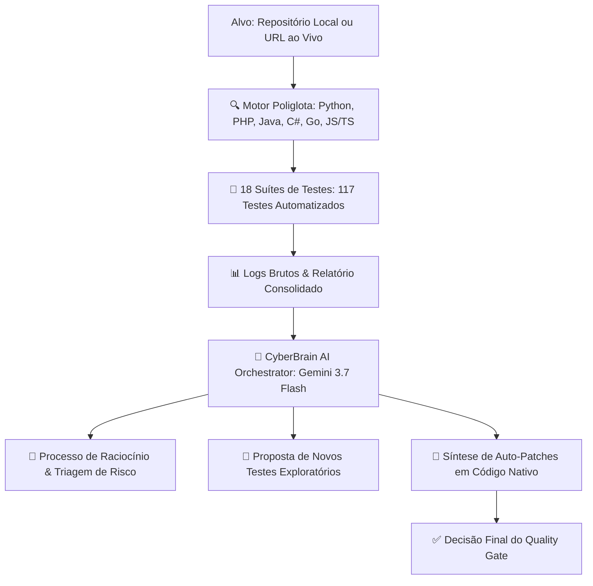

# 🛡️ ObsidianSec // Autonomous DevSecOps Platform & Defense Encyclopedia

Um ecossistema completo de engenharia de segurança defensiva, auditoria de borda web, testes de penetração automatizados (DAST/SAST Poliglota), blindagem de navegador (**Browser Security Shield**), defesas para aplicações de IA (**OWASP LLM Top 10**), conformidade **LGPD (Lei nº 13.709/2018)** e um **Motor Cognitivo de IA (CyberBrain)** com ciclo autônomo de análise de logs e auto-remediação.

---

## 📑 Sumário

- [Visão Geral da Arquitetura](#-visão-geral-da-arquitetura)
- [O Cérebro Cognitivo de IA (CyberBrain)](#-o-cérebro-cognitivo-de-ia-cyberbrain)
- [Suporte Universal & Poliglota](#-suporte-universal--poliglota)
- [As 18 Suítes de Testes Automatizados (117 Testes)](#-as-18-suítes-de-testes-automatizados-117-testes)
- [Instalação e Comandos de Execução](#-instalação-e-comandos-de-execução)

---

## 🏛️ Visão Geral da Arquitetura

O sistema opera sob o modelo de **Defesa em Profundidade Multicamadas**:



---

## 🧪 As 18 Suítes de Testes Automatizados (117 Testes)

| Suíte | Foco da Análise | Testes |
| :--- | :--- | :---: |
| **OWASP API Top 10** | BOLA, BOPLA, Mass Assignment, BFLA, Webhooks HMAC | 16 testes |
| **Browser Advanced** | Matriz CORS, Fetch Metadata, CSRF Double Submit, XSS Polyglot | 11 testes |
| **Cloud & Metadata Traversal** | SSRF 169.254.169.254, Evasão Hex/Decimal, Path Traversal, Zip Slip | 10 testes |
| **Crypto & Auth Session** | JWT Algorithm Confusion, Timing Attacks, OAuth PKCE, ReDoS | 9 testes |
| **Red Team DAST** | BOLA, tokens JWT `alg: none`, bypass de CAPTCHA | 9 testes |
| **Browser Shield** | Cookies `__Host-`, anti-Clickjacking, anti-OOM Stream Guard | 8 testes |
| **Polyglot Scanner** | Regras para Python, PHP, Java, C#, Go e Node | 8 testes |
| **Engenharia do Caos** | Queda de Host, migração de líder, Zalgo Text | 6 testes |
| **WebSockets & Realtime** | CSWSH, message flooding, max frame size, channel auth | 6 testes |
| **CSP Analyzer Engine** | Validação profunda de diretivas CSP Level 3 | 6 testes |
| **Pentest Multiplayer** | Spoofing de comandos, trapaça de votos, XSS em nicknames | 5 testes |
| **LLM Guard** | Prompt Injection, Redação de PII, Output Schema Zod | 5 testes |
| **Prototype Shield** | Poluição de protótipo, manipulação de `__proto__` | 4 testes |
| **Browser Hardening** | CSP Level 3 `'strict-dynamic'`, Trusted Types W3C | 4 testes |
| **Web Dashboard & LGPD** | Rate limiting anti-bot, legal disclaimer, compliance | 4 testes |
| **Knowledge Hub Wiki** | NIST Zero Trust, PQC, SLSA, ASVS, LGPD compliance | 3 testes |
| **Resiliência a DoS** | HTTP Flood concorrente, botnets sob o mesmo IP | 3 testes |
| **CyberBrain AI Loop** | Ciclo cognitivo de raciocínio, auto-patches e novos testes | 1 teste |
| **TOTAL GERAL** | **Cobertura 360° de Segurança em Aplicações Web e Cloud** | **117 Testes** |

---

## 🚀 Instalação e Comandos de Execução

### 1. Rodar Todos os 105 Testes (Vitest):
```bash
npm test
```

### 2. Rodar a Auditoria DevSecOps Completa (7 Agentes):
```bash
npm run security:audit
```

### 3. Rodar o Auditor Universal (Qualquer Pasta ou Site):
```bash
node scripts/audit_target.mjs https://bot.matheusdev.com.br
```

### 4. Rodar o CyberBrain com Inteligência Artificial:
```bash
node scripts/ai_squad_runner.mjs https://bot.matheusdev.com.br
```
