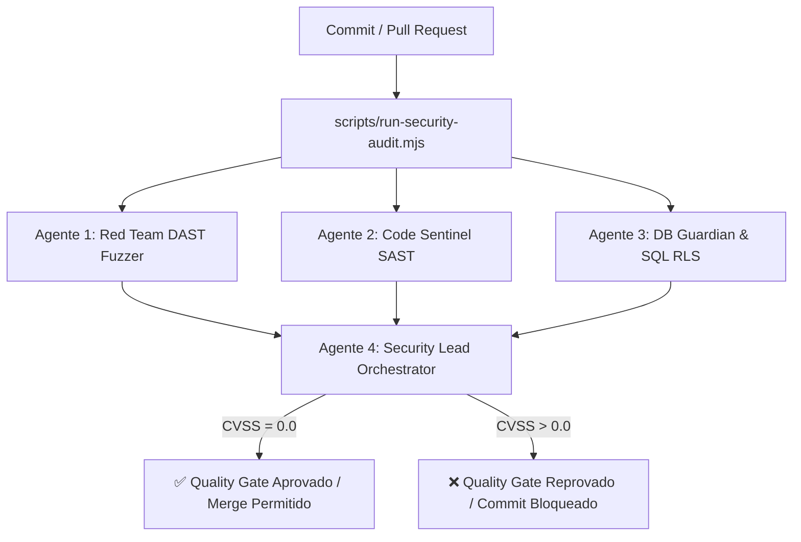

# 🤖 Pipeline DevSecOps Multi-Agente & Automação de Quality Gate

Este guia detalha a operação do **Esquadrão DevSecOps Multi-Agente** no ecossistema BomberCyber.

---

## 👥 1. Os Agentes do Esquadrão



### 1️⃣ Code Sentinel (SAST)
* **Arquivo:** `scripts/security_squad/sast_sentinel.mjs`
* **Função:** Análise estática da árvore de código-fonte (`src/`). Detecta chaves de API expostas, segredos de serviço, uso de `eval()` e algoritmos criptográficos fracos.

### 2️⃣ DB Guardian (SQL RLS Auditor)
* **Arquivo:** `scripts/security_squad/db_guardian.mjs`
* **Função:** Inspeciona migrações SQL (`supabase/migrations/`) para garantir que 100% das tabelas possuem `ENABLE ROW LEVEL SECURITY` e que nenhuma concessão perigosa foi dada a `anon`.

### 3️⃣ Red Team DAST Fuzzer
* **Arquivo:** `tests/security/dast_fuzzer.test.ts`
* **Função:** Executa simulações dinâmicas de ataques HTTP em tempo de execução via motor Vitest, cobrindo BOLA, manipulação de tokens JWT, estouro de rate limiting e desafios CAPTCHA.

### 4️⃣ Security Lead Orchestrator
* **Arquivo:** `scripts/security_squad/lead_orchestrator.mjs`
* **Função:** Consolida todos os relatórios, calcula o CVSS v3.1 ponderado e aplica a política de Zero Tolerância (Quality Gate bloqueia com qualquer pontuação acima de 0.0).

---

## 🛠️ 2. Comandos Operacionais

### Executar a Auditoria Completa:
```bash
npm run security:audit
```

### Executar Somente os Testes de Segurança (Vitest):
```bash
npm test
```

### Executar Análise Estática SAST:
```bash
npm run security:sast
```

### Executar Auditoria de Banco de Dados:
```bash
npm run security:db
```

---

## 🔄 3. Integração com CI/CD e Git Hooks

* **Pre-commit Hook:** Localizado em `.githooks/pre-commit`, executa automaticamente o auditor antes que qualquer desenvolvedor conclua um commit.
* **GitHub Actions:** O workflow `.github/workflows/security-audit.yml` é acionado em cada `push` e `pull_request` para as branches principais, bloqueando deploys em caso de vulnerabilidades.
