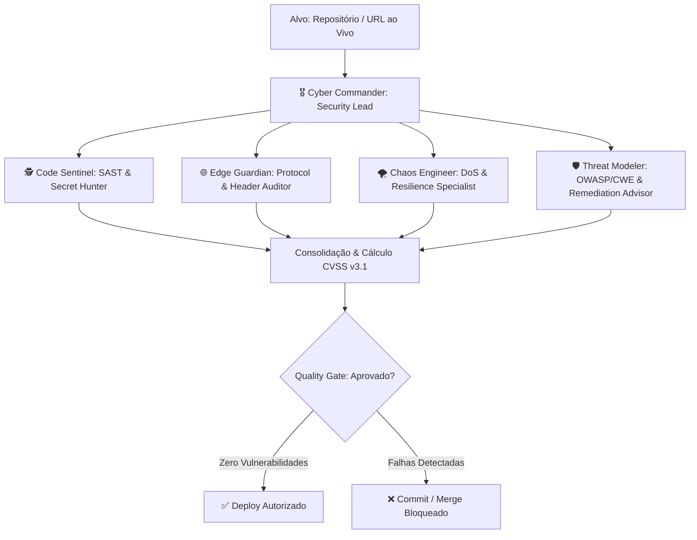

# 🛡️ ChimeraGuard Autonomous Security Squad Framework

Inspirado em arquiteturas de ponta de agentes autônomos (como OpenClaw, Hermes-Agent e LangGraph), o **ChimeraGuard Autonomous Security Squad** é um framework multi-agente focado em segurança defensiva, auditoria contínua e garantia de qualidade (Quality Gate).

---

## 👥 1. As 5 Personas do Esquadrão



### 1️⃣ Cyber Commander (Security Lead)
* **Função:** Orquestrador mestre. Planeja as etapas de teste, agrega os achados dos agentes, calcula a pontuação de risco global CVSS v3.1 e toma a decisão do Quality Gate.
* **System Prompt:** Localizado em [`src/agents/prompts/index.ts`](../src/agents/prompts/index.ts).

### 2️⃣ Code Sentinel (SAST & Secret Hunter)
* **Função:** Analisa o código-fonte procurando segredos (tokens, chaves privadas), chamadas inseguras (`eval`, `innerHTML`), algoritmos JWT fracos (`alg: none`) e injeções SQL/CSV.

### 3️⃣ Edge & Protocol Guardian
* **Função:** Inspeciona servidores de borda, cabeçalhos HTTP, regras de Content-Security-Policy (CSP Level 3), mitigação de Clickjacking (`X-Frame-Options`), HSTS e Cookies seguros.

### 4️⃣ Chaos & DoS Specialist
* **Função:** Estressa o sistema com concorrência massiva (`Promise.all`), simula botnets sob o mesmo IP, injeções de Zalgo Text e quedas abruptas de conexões.

### 5️⃣ Threat Modeler & Remediation Advisor
* **Função:** Mapeia cada vulnerabilidade para a taxonomia internacional (OWASP Top 10, CWE, MITRE ATT&CK) e gera os patches de correção de código em tempo real.

---

## 🚀 2. Como Executar o Esquadrão

### Auditoria Completa do Repositório Local:
```bash
npm run security:audit
```

### Auditoria de uma URL Externa / Site ao Vivo:
```bash
node scripts/run_live_tests.mjs
```

---

## 📋 3. System Prompts Customizados

Todos os agentes possuem diretrizes formais de raciocínio estruturadas em `src/agents/prompts/index.ts`, garantindo que nenhuma análise produza falsos positivos e que todo problema seja acompanhado de uma solução prática em código.
